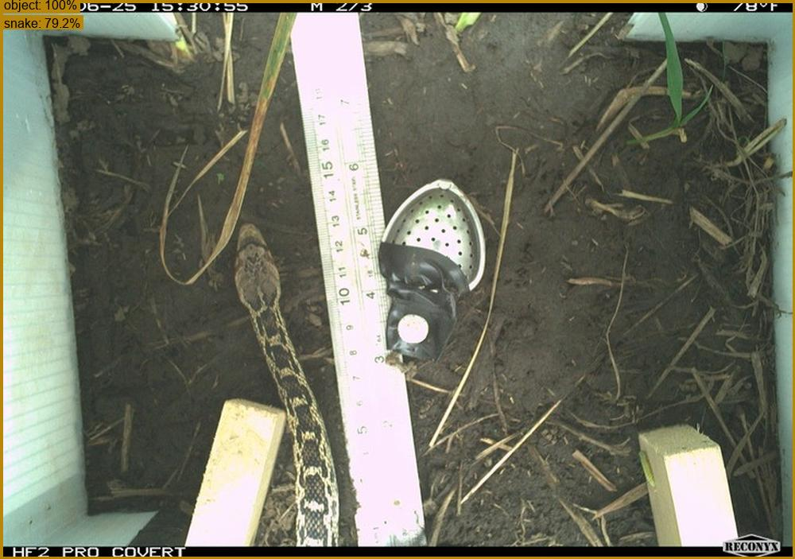

# California Small Animals Classifier

This repo contains training and evaluation code for an image classifier trained on the [California Small Animals](https://lila.science/datasets/california-small-animals/) camera trap dataset.  This dataset is provided by California Fish and Wildlife; it contains images from downward-facing, short-focus Reconyx cameras intended for small animal monitoring.

This README is not intended (yet) as an external introduction to the project, it's intended as internal book-keeping, so, excuse all the local filenames that have no meaning other than the computer where I'm typing this.



## Dataset at a glance

- 2,278,071 images across 701 cameras (each leaf-node folder is a camera deployment/location)
- Metadata in COCO Camera Traps format (`california_small_animals_with_sequences.json`)
- ~58% empty (images labeled as `blank` or `misfire`)
- Long-tailed taxonomy (257 source categories, full class/order/family/genus/species on each)
- Mostly 2048x1440 JPEGs
- Raw dataset is in `e:\data\california-small-animals`

See `analyze_metadata.py` / `analyze_taxonomy.py` (in the output folder) for the full breakdown, and `build_label_map.py` for the source→target category mapping.

## Plan

- Single, flat multi-class classifier over a medium-granularity label set (29 classes = 27 animal + `blank` + `setup_pickup`); see `label_map.py`. Provenance (camera split + category assignments) is recorded in `training_info.20260608.json`.  Here we use "single, flat" to contrast this approach with a hierarchical approach that we may pursue in the future, where a first model classifies, e.g., blank/non-blank, or blank/mammal/reptile/bird/amphibian, etc., and subsequent, taxa-specific models classify species.
- Split by camera, 85/15 train/val, class-aware via ILP (every class lands ~15% in val and appears on both sides).  Locked in `camera_split.csv`. See `make_split.py`.
- `blank` downsampled to 1 frame/sequence, then capped 300/camera (~115k). Multi-annotation images (9,372) dropped. ~1.06M images total.
- Stored training copies: whole frame resized to ~512px short side (JPEG q90) under `F:\data\california-small-animals-training` as `train/<class>/<camera>__<id>.jpg`.
- Backbone: timm `eva02_large_patch14_448.mim_m38m_ft_in22k_in1k` @ 448px, trained with PyTorch Lightning on 2x RTX 4090 (DDP). Checkpoint every epoch.

### Training environment

Native Windows PyTorch is missing FlashAttention/mem-efficient SDPA (falls back to the slow math kernel), Triton (so `torch.compile` won't run), and NCCL (gloo-only multi-GPU). Measured eva02_large@448 at only ~20 img/s/GPU on Windows. Training therefore runs in WSL (Ubuntu, conda env `california-small-animals-wsl`), which has all three. Data is read from `/mnt/f`; logs/checkpoints go to `/mnt/c/temp/california-small-animals-output`. Launch via `train.sh`.

Fast config (accuracy-safe): autocast bf16 (fp32 master) + grad-checkpointing + `torch.compile` → \~37 img/s/GPU (vs 22 uncompiled). 

Performance notes: `torch.compile` + DDP needs `torch._dynamo.config.optimize_ddp = False` (DDPOptimizer chokes on EVA's rope/SDPA subgraph); `PYTORCH_CUDA_ALLOC_CONF=expandable_segments:True` avoids compile-time fragmentation OOMs; per-GPU batch 24. Measured \~64 img/s on 2 GPUs (both \~100% util, \~12 GB each), \~4.2 h/epoch (18,618 steps).

### The path config file

All machine-specific absolute paths live in a small JSON file passed to every script via `--path-config`, so nothing under `src/` (or `train.sh`) hard-codes a path and the same code runs unchanged on any machine. `src/path_config.py` loads and validates it; `train.sh` reads `OUTPUT_ROOT` from it to place the run folder.

It is per *environment*, not just per machine: `wingpu` runs training under WSL (`/mnt/...` paths) but eval under native Windows (drive-letter paths), so it keeps two files, `configs/wingpu-wsl.json` and `configs/wingpu-windows.json`; `ubuntu-gpu` (native Linux) needs only one. A template lives at `path_config.example.json`; the real configs are gitignored (anything matching `path_config*.json` other than the example, plus `configs/`).

Required keys (all must be present):

- `METADATA_FILE`: the COCO Camera Traps metadata JSON.
- `IMAGE_ROOT`: root of the original (full-size) image tree.
- `OUTPUT_ROOT`: output base folder (holds `runs/`, `split.parquet`, `manifest.parquet`, the locked split, etc.).
- `TRAIN_ROOT`: root of the resized train/val tree.
- `EXCLUDE_FILES`: list of manual-review JSON files (see "Label review / data cleanup"); images marked `incorrect` are dropped from training. Use `[]` for none, but the key is still required. To reproduce the cleaned training set on another machine, copy the review JSON over and point this at it.  Currently this does exact matching on the filename stem only, so "a/b/c/xxxyyy111222.JPG" is the same as "xxxyyy111222.JPG".

Each script reads only the keys it needs (e.g. `train.py` uses `OUTPUT_ROOT`, `TRAIN_ROOT`, and `EXCLUDE_FILES`), but all keys are required so one file fully describes a machine/environment. Example:

```json
{
 "METADATA_FILE": "E:\\data\\california-small-animals\\california_small_animals_with_sequences.json",
 "IMAGE_ROOT": "E:\\data\\california-small-animals",
 "OUTPUT_ROOT": "C:\\temp\\california-small-animals-output",
 "TRAIN_ROOT": "F:\\data\\california-small-animals-training",
 "EXCLUDE_FILES": [
  "E:\\data\\california-small-animals\\manual_review_20260628.json"
 ]
}
```

### Starting training

From a WSL shell, in the repo root, in a conda environment with requirements.txt installed:

```bash
export RUN_NAME="eva02-20260630-base-repro"
./train.sh --devices 2 --batch-size 24 --workers 12 --epochs 20 --patience 3 --intermediate-checkpoints-per-epoch 8 --run-name ${RUN_NAME} --checkpoint-folder ~/data/checkpoints-${RUN_NAME} --path-config configs/wingpu-wsl.json
```

`--intermediate-checkpoints-per-epoch` enables weights-only checkpoints during each epoch, in addition to the checkpoints written at the end of each epoch.  These are used for post-hoc evaluation of whether validation accuracy is significantly peaking mid-epoch.

`--checkpoints-folder` allows checkpoints to written to a temporary location that's different than the final output folder, useful when training on WSL but planning to move everything to a Windows drive (writing checkpoints across a Windows mount has a habit of freezing PyTorch).

`--patience 5` enables early stopping on `val/acc_macro` (stops if macro accuracy hasn't improved for 5 epochs); omit it for a fixed `--epochs` run. Each run writes everything to its own folder `runs/<run-name>/` (see "Output folder structure" below); `--run-name` defaults to a timestamp, and the launcher refuses to reuse an existing run folder.  Track progress via `runs/<run-name>/metrics.csv` (or `nvidia-smi`); the best epoch's checkpoint (by `val/acc_macro`) is the one to keep.

Other options passed through to the optimizer:

* `--lr`: base learning rate that takes effect after warmup, default 1e-4
* `--weight-decay`: AdamW weight decay (helps avoid large weights, at the risk of underfitting), default 0.05
* `--label-smoothing`: softens cross entry loss, stops the model from fully trusting any single possibly-wrong label, default 0.1
* `--weight-scheme`: how per-class loss weights are set to counter the long tail (none will favorite common classes, inv upweights rare classes, sqrt in between.  Default sqrt (choices ["none", "sqrt", "inv"]).
* `--freeze-backbone`: train only the classifier head, default False
* `--layer-decay`: turns on layer-wise learning rate decay; learning rate shrinks exponentially toward the input end of the backbone (e.g. `--layer-decay` 0.75 would scale from 1e-4 to 7.5e-8) (default 1.0 == no decay)
* `--warmup-epochs`: number of epochs to spend at a fraction of the base LR (currently 1% of base LR, hard-coded), default 1 epoch
* `--warmup-steps`: warm up for a number of steps, rather than a number of epochs, default 0 (unused)

For a head-only training run (linear probe):

```bash
export RUN_NAME="eva02-20260629-lp"
./train.sh \
  --devices 2 --batch-size 24 --workers 12 \
  --freeze-backbone --lr 1e-3 --warmup-steps 200 \
  --epochs 4 --patience 2 \
  --intermediate-checkpoints-per-epoch 8 \
  --checkpoint-folder ~/data/checkpoints-${RUN_NAME} \
  --run-name ${RUN_NAME} \
  --path-config configs/wingpu-wsl.json
```

### Hyperparameter notes

* The default learning rate schedule looks like [1e-6, 1-e4, 9.93e-5, 9.73e-5, 9.40e-5, 8.95e-5].  This is what we used for eva02-20260628.  78% macro accuracy.


### Resuming training

Resume an interrupted training run by passing the same value for `--run-name`, along with `--resume last`.  It is recommended to supply values for all the other parameters that match the original training run, but it's not required, e.g., you could theoretically change the batch size between starting a training run and resuming the same training run.

On resume, the existing `metrics.csv` is first copied to a timestamped `metrics.<timestamp>.csv` in the run folder, because Lightning's `CSVLogger` truncates `metrics.csv` when it re-initializes (it does not read the prior rows). The live `metrics.csv` therefore holds only the latest segment, so the full per-epoch history is spread across all `metrics*.csv` files: anything that reads per-epoch metrics (e.g. copy_best_checkpoint.py) should scan all of them, not just `metrics.csv`.

### Monitoring training

#### Debug output

```bash
watch -n 10 tail -n 20 /mnt/c/temp/california-small-animals-output/runs/${RUN_NAME}/train_${RUN_NAME}.log
```

#### Accuracy metrics

Training losses are updated every batch, validation metrics are written every epoch.

```bash
watch -n 10 tail -n 20 /mnt/c/temp/california-small-animals-output/runs/${RUN_NAME}/metrics.csv
```

### When training finishes

#### Computing accuracy metrics for all checkpoints

Because the model tends to peak within the first epoch (and we write extra intermediate checkpoints through each epoch via `--intermediate-checkpoints-per-epoch`), we want validation accuracy for *every* checkpoint, not just the once-per-epoch numbers in `metrics.csv`. `evaluate_all_checkpoints.py` does that: it takes a checkpoint folder, an image folder, a ground-truth COCO file, and an output folder, and for each `*.ckpt` it strips the checkpoint to a temporary inference checkpoint (via `strip_checkpoint.py`), runs inference (via `run_inference.py`, sharding across GPUs with `--devices`), writes a MegaDetector-format results file into the output folder, and scores it against the ground truth (micro accuracy and macro / mean-per-class recall, compared by class name).

```bash
python evaluate_all_checkpoints.py ^
  "c:\temp\california-small-animals-output\runs\eva02-20260629-lp\checkpoints" ^
  "c:\data\california-small-animals-training\val" ^
  "f:\data\california-small-animals-training\val\val_cct.json" ^
  "c:\temp\california-small-animals-output\runs\eva02-20260629-lp\eval" ^
  --devices 2
```

It runs on native Windows (like all our inference). The output folder ends up with one `<checkpoint-stem>.json` per checkpoint plus `accuracy_by_checkpoint.csv`, which has one row per checkpoint with columns `checkpoint_filename`, `checkpoint_index`, `accuracy` (micro), and `macro_accuracy`. `checkpoint_index` is -1 for `last.ckpt` and the 0-based training order (by `global_step`) for the rest, so sorting by it gives the chronological accuracy curve across both the intermediate and end-of-epoch checkpoints. The pass-through flags `--batch-size`, `--workers`, `--precision`, `--classifications`, and `--devices` are forwarded to each `run_inference` call (in practice only `--devices 2` is changed from the defaults; `run_inference` handles the multi-GPU split, so this script does not parallelize on its own). The run is resumable: a checkpoint whose results JSON already exists is re-scored without re-running inference, so delete a JSON to force its recomputation. Expect roughly 15 to 20 minutes per checkpoint over the full val set at `--devices 2`.

#### Extracting the best checkpoint

After a run finishes (or you stop it early), the usual next step is to extract the single best epoch as a compact, inference-ready checkpoint. `copy_best_checkpoint.py <run-name>` does this: it finds the epoch with the highest `val/acc_macro`, strips the optimizer/scheduler/callback state from that epoch's checkpoint (reusing `strip_checkpoint.py`), and writes `<run-name>.best.epochNN.stripped.pt` to the run-folder root. That `.stripped.pt` is the self-describing inference format documented under "Inference-ready checkpoints", and is what `run_inference.py` consumes. The script errors if the chosen epoch's checkpoint is missing; pass `--half` to store fp16 weights.

```bash
python copy_best_checkpoint.py ${RUN_NAME}
```

It reads every `metrics*.csv` in the run folder, not just `metrics.csv`, because a resumed run spreads its per-epoch history across multiple files (see "Resuming training"). If the same epoch appears in more than one file (an abandoned attempt plus its post-resume redo), the highest-`step` row wins so the score matches the checkpoint actually on disk; ties on `val/acc_macro` go to the later epoch.

### Output folder structure

The base output folder `C:\temp\california-small-animals-output` (`/mnt/c/temp/...` in WSL) holds only cross-run files; everything produced by a single training run lives under `runs/<run-name>/`.

Base folder — shared across all runs (six files):

- `split.parquet` — per-image train/val assignment + resized-image paths; read by `train.py` on every run.
- `manifest.parquet` — per-image source-of-truth manifest (kept images, labels, camera, sequence); input to `make_split.py`.
- `camera_split.parquet` — the locked camera→split (train/val) assignment.
- `camera_split.csv` — the same assignment, human-readable.
- `camera_class_counts.parquet` — per-camera per-class image counts (informational).
- `wsl_train.sh` — the training launcher.

Per-run folder `runs/<run-name>/`:

- `checkpoints/` — per-epoch checkpoints (`<run-name>-NN.ckpt`) plus `last.ckpt`.
- `hparams.yaml` — the run's hyperparameters.
- `metrics.csv` — train/val metrics (loss, micro/macro accuracy, learning rate).
- `train_<run-name>.log` — full stdout/stderr log of the run.

Archive folder (`archive`) — one-off scripts, exploratory logs, and throwaway debug/verification outputs. Anything clearly not reusable across runs should go *straight here* rather than the base folder, so the base folder stays limited to the cross-run files listed above. Obvious one-offs — diagnostic/launcher scripts, ad-hoc test or invariance outputs, logs from exploratory work — belong in `archive`; when it's genuinely unclear whether an output will be reused, it's fine to leave it in the base folder. Nothing in `archive` is deleted automatically; the maintainer prunes it manually.  This folder is interchangeably referred to as the "archive folder" or the "scratch folder".

### Preprocessing and augmentation

- **448×448 input by squashing the whole frame**.  No scale-crop, no center-crop. With image-level labels and a small animal anywhere in frame, aggressive `RandomResizedCrop` would frequently crop the animal out, and val center-crop would clip edge animals. The downward-facing/baited-box geometry means low scale variation, so the whole frame at a fixed scale is fine, and train/val share the same field of view.
- **Info-banner handling.** Reconyx top/bottom banners carry timestamp + temperature (a shortcut the model could exploit, that won't transfer to other cameras) and are the only consistent orientation cue. We *crop the banner at training* (measured for this dataset) and add *synthetic-banner augmentation* (random dark bars of varying height/content at top/bottom) so the model learns to ignore arbitrary banners on *other* cameras at inference. Day/night info still comes for free from IR-grayscale vs daytime color. The inference script makes the banner crop configurable (independent top/bottom; default off — robust thanks to the synthetic-banner aug).
- **Geometric aug** (banner cropped ⇒ no canonical up/down): horizontal and vertical flips, 90°/mild rotation, mild affine translate/scale with reflection padding. Position jitter specifically fights camera-background memorization (cameras are static and we split by camera).
- **Photometric aug**: brightness/contrast/saturation/hue, mild blur/noise.
- Class imbalance handled at train time (balanced sampling / loss weighting), not by deleting animal data.

## Inference-ready checkpoints

`strip_checkpoint.py` converts a Lightning training checkpoint into a compact, self-describing `*.stripped.ckpt` (optimizer/scheduler/callback state removed; ~3.6 GB → ~1.2 GB). It is a plain dict saved with `torch.save` (load with `weights_only=False`); everything except `state_dict` is configuration metadata, i.e. plain numbers/strings, not code or a graph. `run_inference.py` reads these fields to rebuild the model and its preprocessing. Stored fields:

- `format` — schema tag (`csa-classifier-inference-v1`).
- `model_name` — the timm model id used to recreate the architecture.
- `num_classes` — number of output classes.
- `classes` — the ordered list of class names; the list index is the model's output label id.
- `img_size` — the square input size the model expects (e.g. 448).
- `norm_mean`, `norm_std` — per-channel normalization (from the timm model's data config).
- `banner_crop` — `{top, bottom}` fractions of image height that were cropped off the top/bottom during training (a record of the training-time preprocessing; the inference script's own banner handling is configured separately).
- `preprocessing` — a human-readable description of the preprocessing pipeline.
- `weights_dtype` — `float32` or `float16` (the dtype the weights are stored in).
- `source_checkpoint`, `epoch`, `global_step` — provenance: which training checkpoint this was derived from.
- `state_dict` — the timm model weights (the only non-metadata payload).

## Label review / data cleanup

After the first training run we ran a label-cleanup pass focused on *blank ↔ non-blank* ground-truth errors — the most common and most consequential mislabels in this dataset — using the model's own high-confidence disagreements to prioritize what a human looks at. The review outcome is stored back with the data (`E:\data\california-small-animals\manual_review_<date>.json`) because it is a property of the dataset, not of any one run. The analysis/review scripts live in the analysis workspace `C:\temp\california-small-animals-output\archive\data-review\`; the pipeline scripts that consume the result (`copy_resize.py`, `make_gt_coco.py`, `make_val_cct.py`) are in this repo.

1. **Find candidates.** Run the chosen model over the full train+val set (`run_inference.py`) and, with `analyze_blank_confusion.py`, tabulate every image whose top-1 prediction disagrees with the folder label on blank-vs-animal, bucketed by confidence. It writes an HTML report (`blank_confusion_analysis.html`) with per-class / per-confidence-bucket counts where each non-zero count links to a gallery of the actual images (no overlaid annotations) for a quick eyeball.
2. **Stage full-size images for review.** `copy_review_images.py` copies the full-size originals of every blank↔non-blank mismatch (confidence ≥ 0.5) from the raw data folder into `C:\temp\california-small-animals-image-review`, laid out as `[label]/[prediction]/[bucket]/[location]_[datetime]_[framenum]_[guid].jpg` so they sort by camera then time. It writes `review_manifest.csv` (maps every review path back to the source image + metadata), and `make_timelapse_csv.py` derives a Timelapse-ready `review_manifest_timelapse.csv` (adds `File`/`RelativePath` columns).
3. **Adjudicate in Timelapse.** Images are reviewed in [Timelapse](https://timelapse.ucalgary.ca/); the reviewer marks an image `incorrect` when the *ground-truth label* is wrong (e.g. labeled `blank` but an animal is clearly present, or vice-versa). An empty outcome means "no decision" (not necessarily confirmed-correct); a `correct` tag is available but has no training impact.
4. **Record outcomes.** `process_review.py` verifies the Timelapse export used only expected tags, maps the `incorrect` rows back to original filenames via the manifest, and writes `manual_review_<date>.json` = `{ "<original/relpath>": "incorrect", ... }` (the dict form leaves room for additional outcome tags later).
5. **Re-train on the cleaned set, same split.** The exclusion list is centralized in `label_map.py` (`EXCLUDE_FILES` + `load_excluded_guids()`), and both `copy_resize.py` (regenerating the training tree) and `train.py` (building the train/val image lists in `load_frames()`) drop the flagged images — so the folder and the trainer can't drift, and `split.parquet` stays the immutable locked split (the camera assignment is reused unchanged). `assess_split_impact.py` first confirms no class loses a split or drops to ≤1 location. After regenerating the tree, `make_gt_coco.py` and `make_val_cct.py` rebuild the master train+val GT (`california-small-animals-training.json`) and the val-only GT (`val/val_cct.json`). Both the copy step and the trainer accept `--no-exclude` to fall back to the full uncleaned set if ever needed.

First pass (2026-06-28): 5,743 images excluded — almost all `blank`-labeled frames that actually contained an animal, plus a few animal-labeled frames that were actually empty. The prior training tree was preserved as `F:\data\california-small-animals-training-2026.06.00`.

## TODO

### P0

- **Explore overfitting:**: results are good, but training is overfitting quickly (peaking at epoch 0), consider (a) intermediate checkpointing, (b) layer freezing, and/or (c) linear probe with high learning rate followed by wider training with a low learning rate.  Specifically an LLRD (layer-wise learning rate decay) experiment, where we enable `--layer-decay` and shorten warmup from a full epoch to just 500 steps (previous experiments showed very fast convergence to an optimal warmup results):

```bash  
export RUN_NAME="eva02-20260630-llrd"
./train.sh --path-config configs/ubuntu-gpu.json --run-name ${RUN_NAME} \
  --devices 2 --batch-size 24 --workers 12 \
  --layer-decay 0.75 --lr 1e-4 --warmup-steps 500 --epochs 8 --patience 3 \
  --intermediate-checkpoints-per-epoch 8
```

- **Add background worker loading/preprocessing to inference script**
- **Data cleanup (blank ↔ non-blank).** First pass DONE (2026-06-28); see "Label review / data cleanup". 5,743 mislabeled images excluded; re-training on the cleaned set. Future: extend the same review workflow to non-blank confusions and other high-confidence disagreements.
- **Inference-time banner-crop A/B (quick):** evaluate val accuracy with the banner crop on vs off, to pick the inference default and confirm the synthetic-banner augmentation actually makes the model crop-agnostic.
- **Test on Ohio Small Animals data, consider adding to training**
- **Test on CCER Small Animals data, consider adding to training**
- **Test on CIC Shrew Monitoring data, consider adding to training**

### P1

- **Add checkpointing to inference script**
- **Reduce penalties for partial mistakes**: consider adjusting the loss function so that for, e.g., a specific rodent species, predicting "other rodent" is penalized less than predicting "bird"
- **New CDFW data:** Talk to CDFW about pulling in additional data
- **Architecture A/B (if we want to push accuracy past eva02_large@448):** candidates to prioritize, roughly in order —
  1. `convnextv2_large` / `convnextv2_huge` @ 384–512 (strong fine-grained CNN, fast).
  2. `eva02_large_patch14_448` is our baseline; also try `eva02_large` at higher test-time resolution (448→512) via timm's dynamic img-size.
  3. DINOv2/DINOv3 ViT-L/g backbones with a linear/MLP head (excellent features; newer than eva02).
  4. `beit_large_patch16_512` / `swinv2_large` as additional convex points.

  Compare on the same camera-split val set; accuracy is the priority, not speed.
- **Hierarchical cascade (alternative to the flat model):** e.g. blank/non-blank → coarse class (mammal/reptile/amphibian/bird/insect/other) → finer visual groups. Could be more robust on the long tail and lets us calibrate a high-recall blank filter independently. Wrap all stages behind one inference script.
- **Banner handling as a *training-time* experiment:** compare (a) no crop, (b) crop only, (c) crop + synthetic-banner aug — on val accuracy and cross-camera robustness. Revisit whether to crop at train at all. (The inference-time A/B in the TODO list is the quick first cut of this.)
- **Rectangular-input fine-tuning** (e.g. 448×630 to match the ~1.42:1 frame aspect via pos-embed interpolation) to avoid the squash distortion entirely.

### P2

- Revisit `unknown` (736) — currently excluded; could become an abstain/OOD target.
- Consider keeping the vertebrate label on multi-annotation images to recover ~9k images.

#### Training crash due to WSL I/O timeout

DDP training runs in WSL2 but writes a ~3.4 GB checkpoint to `/mnt/c` every epoch and reads images from `/mnt/f`, both over the 9p mount. Under load 9p can intermittently stall (a syscall can wedge in uninterruptible D-state), the same instability that pushed inference to native Windows. When one rank stalls on such a write the other rank keeps spinning in the epoch-boundary NCCL collective until the 30-minute watchdog times out and tears the whole run down. Seen on run `eva02-20260628`: epoch 2 validated and logged its metrics but the epoch-2 checkpoint write hung (no `-02.ckpt`, while `-00`/`-01` had saved fine, so the stall is intermittent rather than deterministic); the crash signature is `ProcessGroupNCCL ... Watchdog caught collective operation timeout ... ALLREDUCE ... Timeout(ms)=1800000`. Recovery is cheap since checkpoints are per-epoch (`--resume last`).

Temporary fix (implemented): `train.py --checkpoint-folder <dir>` writes checkpoints to `<dir>/<run-name>/` during the run; point it at a fast WSL-local (ext4) folder (e.g. `~/csa-checkpoints`) so the big per-epoch write never touches 9p, which is where the hang occurred. `metrics.csv`, `hparams.yaml`, and the training log stay in the run folder on `/mnt/c` (tiny appends, still monitorable from Windows). On a clean finish `train.py` moves the checkpoints into `runs/<run-name>/checkpoints/` (this single final move may itself stall on 9p, but the run is already done; on a crash or early cancel it is skipped, so move them manually). This keeps both GPUs and adds no ongoing coupling between the WSL and Windows outputs. Note it isolates the checkpoint-write path where the hang occurred; a 9p read stall on `/mnt/f` during data loading remains a smaller, unaddressed vector.

More permanent options to pursue later (deliberately not moving to single-GPU training, or to anything that more tightly couples the WSL and Windows outputs):

1. Move all training *output* (logs, checkpoints, metrics) onto the WSL ext4 partition while still reading images from `/mnt/f`, and copy results back to Windows after a run. Probably fits now given how few epochs a run takes, at worst needs freeing a little space.
2. Move *everything*, including the resized training images, onto WSL ext4. Needs clearing more space, still not a big deal.
3. Create a second, larger WSL ext4 partition (another vhdx) with ample free space, avoiding both 9p and having to free space on the current partition.

## Dataset bugs found

- `zebra-tailed lizard` (id 230): `order` = `"phrynosomatidae"` should be `"squamata"`.
- `western diamondback rattlesnake` (id 235): `family` = `"viperdae"` should be `"viperidae"`.
- `aspidocelis species` (id 239) is a misspelled duplicate of `aspidoscelis species` (id 158).
